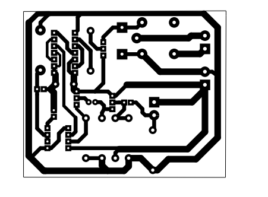
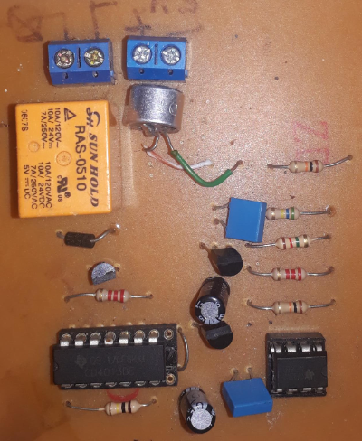
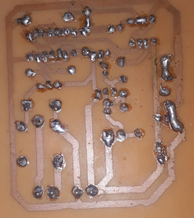

<!DOCTYPE html>
<html lang="pt-br">
<head>
    <meta charset="UTF-8">
    <meta name="viewport" content="width=device-width, initial-scale=1.0">

# PCB

PCB desenvolvida no KICAD para a disciplina de desenho técnico aplicado.  
Trata-se do circuito clapper. Ao dar palmas o relé aciona a saída, que pode ser uma lampada

  <h1>Imagens do projeto</h1>
</head>
<body>
<h2>PCB</h2>

    

        <h2>Componentes na parte superior</h2>    
        
    

    

        <h2>Componentes Eletrônicos:</h2>
        <ul>
            <li>2 Resistores de 2.2K ohms (2K2)</li>
            <li>2 Resistores de 1K ohms</li>
            <li>2 Resistores de 10K ohms</li>
            <li>1 Resistor de 560K ohms</li>
            <li>1 Resistor de 1M2 (1.2M ohms)</li>
            <li>1 Transistor BC337</li>
            <li>2 Transistores BC548</li>
            <li>1 Capacitor eletrolítico de 10 microfarads (10uF)</li>
            <li>1 Capacitor eletrolítico de 100 microfarads (100uF)</li>
            <li>1 Capacitor cerâmico de 100 nanofarads (100nF)</li>
            <li>1 CI 555 </li>
            <li>1 CI 4017 </li>
            <li>1 Diodo retificador 1N4002</li>
            <li>1 Microfone de eletreto (sensor de som)</li>
            <li>1 Relé de 5V (dispositivo eletromecânico de controle)</li>
            <li>1 LED </li>
        </ul>
    

<h2>Trilhas, parte de baixo da pcb.</h2>

 Para manter a tinta na fenolite foi utilizado o processo térmico, algumas trilhas ficaram com falha, por este motivo foi utilizado solda excessiva como correção.

</body>
</html>
    
