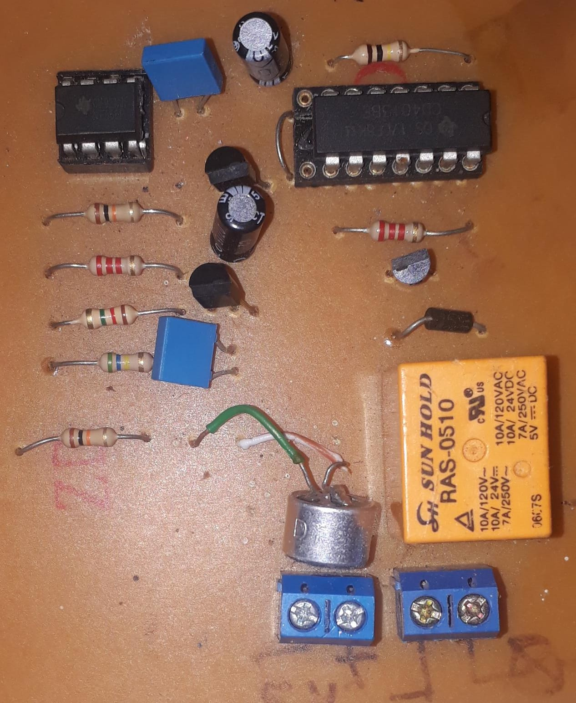
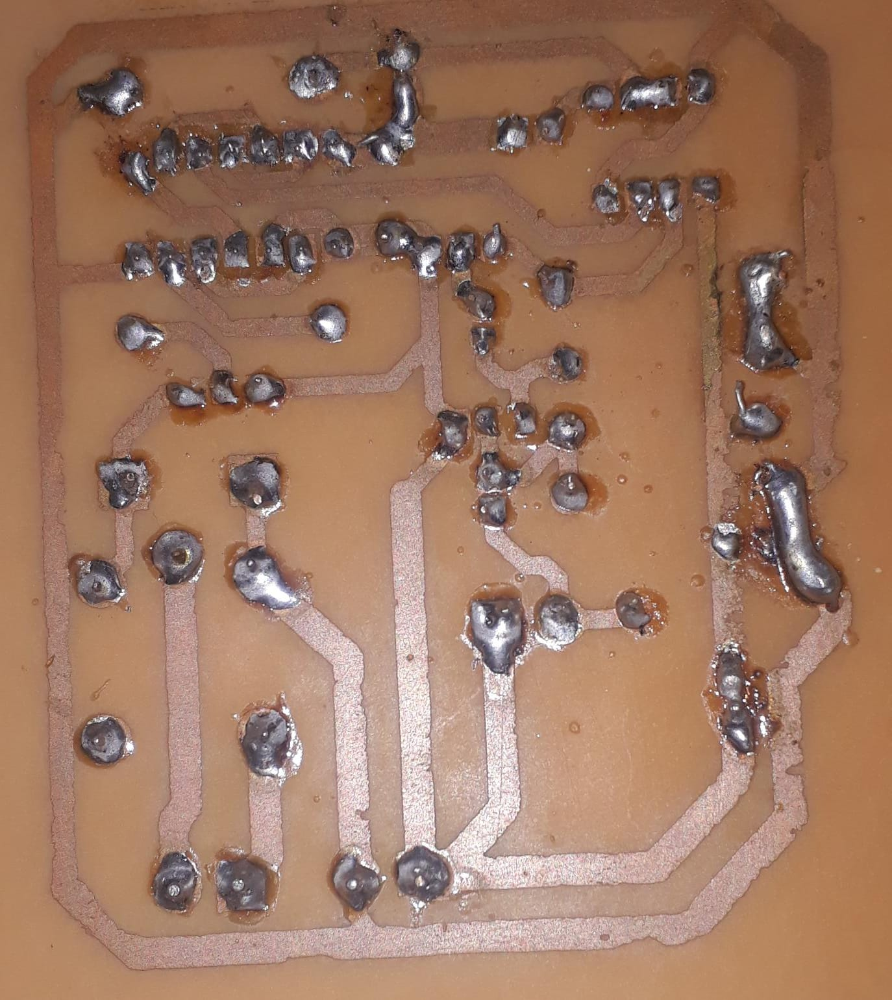

<!DOCTYPE html>
<html lang="pt-br">
<head>
    <meta charset="UTF-8">
    <meta name="viewport" content="width=device-width, initial-scale=1.0">
    
# PCB

PCB desenvolvida no KICAD para a disciplina de desenho técnico aplicado.  
Trata-se do circuito clapper. Ao dar palmas o relé aciona a saída, que pode ser uma lampada

  <h1>Imagens do projeto</h1>
</head>
<body>
    <!-- Primeira imagem -->
    

    <!-- Segunda imagem -->
    

    <!-- Terceira imagem -->
    

</body>
</html>
    
